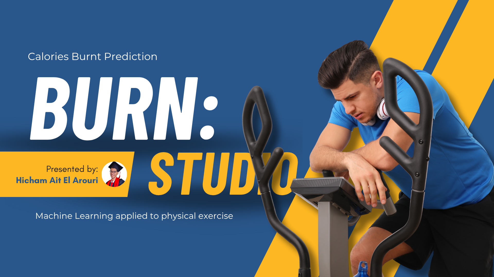

# 🔥 Calories Burnt Prediction Project



### A Machine Learning project that predicts calories burnt during exercise using Python, Scikit-learn, and XGBoost.

<p align="center">
  
  
  
  
</p>

---

## 🎯 About This Project

Generic fitness trackers often provide inaccurate calorie-burn estimates. This project moves beyond one-size-fits-all calculations by building a personalized prediction model.

It uses a dataset of user biometrics (Age, Weight, Height) and exercise data (Duration, Heart Rate, Body Temp) to train a highly accurate **XGBoost Regressor**. The result is a simple web app where a user can input their stats and get a precise calorie-burn prediction.

## ✨ Features

* **📈 In-Depth Analysis:** A complete Jupyter Notebook (`Calories_Burnt_Prediction.ipynb`) exploring the data, visualizing correlations, and testing models.
* **🤖 Powerful ML Model:** An **XGBoost Regressor** trained and saved (`model.pkl`) for high-speed, accurate predictions.
* **🔧 Feature Engineering:** A pre-processing pipeline (`transformer.pkl`) saved to ensure new data is treated exactly like the training data.
* **📊 Interactive Web App:** A user-friendly web interface built with Streamlit (`app.py`) to interact with the model in real-time.

## 🛠️ Tech Stack

* **Core:** Python 3.11
* **Data Analysis:** Pandas, NumPy
* **Data Visualization:** Matplotlib, Seaborn
* **Machine Learning:** Scikit-learn (for pipeline), XGBoost (for model)
* **Web App:** Streamlit
* **Notebook:** Jupyter Lab

---

## 🚀 How To Run This Project

Follow these steps to get the project running on your local machine.

### 1. Prerequisites

* Git
* Python 3.11
* You must have an activated virtual environment (this project uses `venv`).

### 2. Clone the Repository

```bash
git clone [https://github.com/HichamAitElArouri/calories-prediction.git](https://github.com/HichamAitElArouri/calories-prediction.git)
cd calories-prediction
